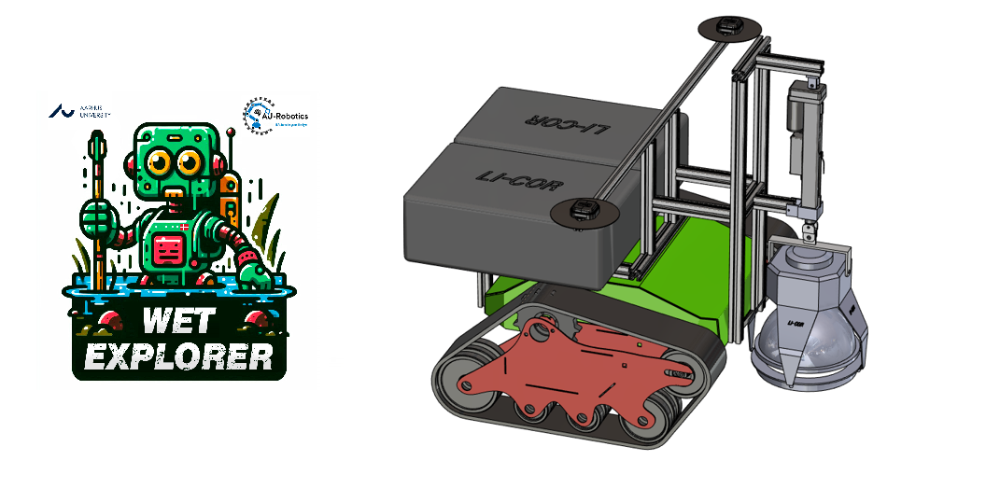
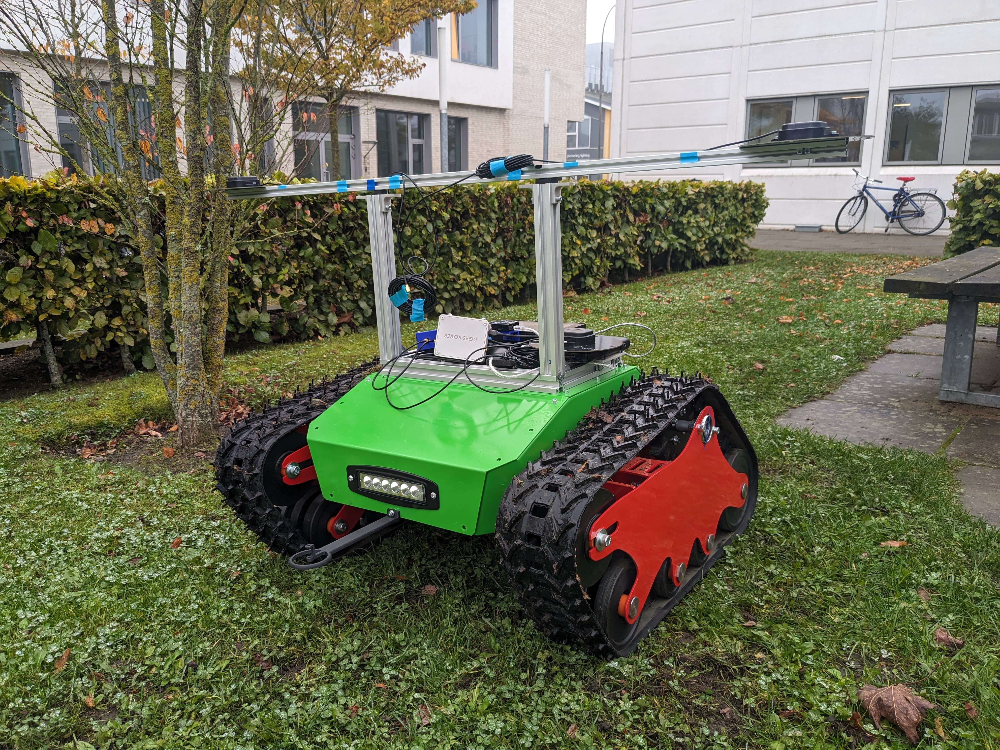
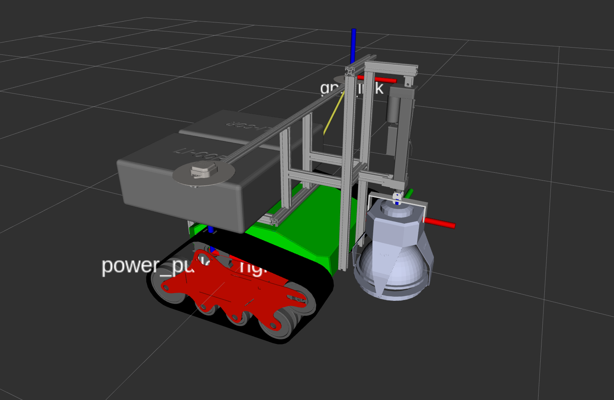
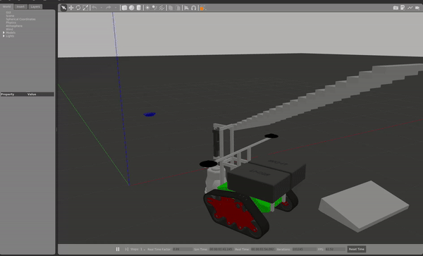
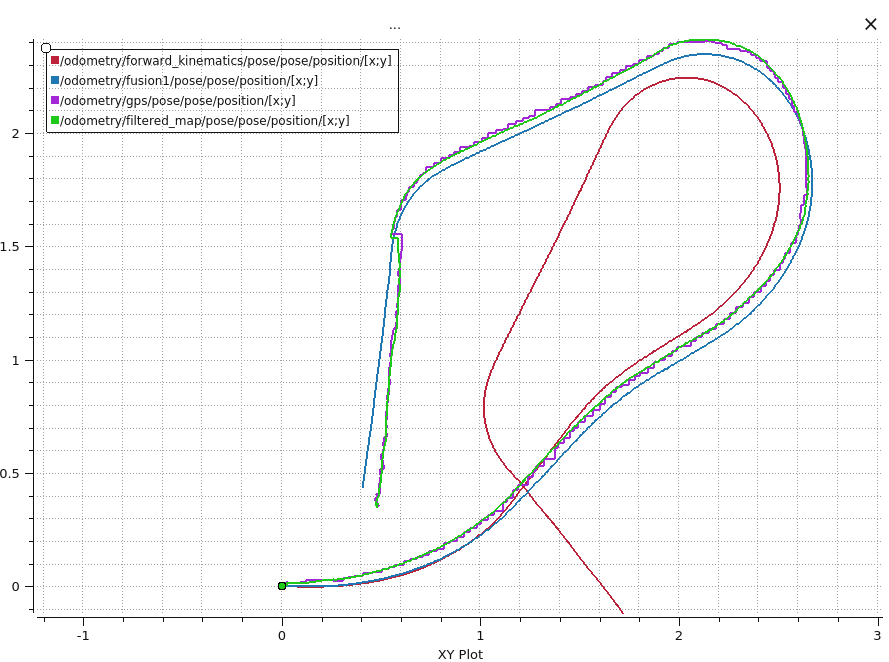

# WetExplorer: Monitoring Wetlands Autonomously

## Overview

The WetGuard project aims to monitor greenhouse gas emissions in wetlands. Disturbances in wetlands can lead to unwanted emissions that impact the environment, making it crucial to assess the ecosystem's health for preservation and a proper restoration process.

The automated sampling task works as follows:


All the sensors combined make up a 25 kg payload. This sampling process must be performed periodically, at night, and even after rain, so it’s essential to have an autonomous system conducting the task.

## Meet WetExplorer

WetExplorer is a tracked robot that navigates autonomously in wetlands, locating the rings needed for sampling and operating the gas analyzer sensors.



## Highlights of the Current Version and My Contributions to the Project

### Simulation


- Digital twin in Gazebo with accurate mass and inertia parameters for each main link.
- Accurate simulation of tracks, we're not using wheels! (based on in-built plugin by [M. Pecka](https://doi.org/10.48550/arXiv.1703.04316)
- Linear actuation of the chamber simulated.
- Manual control via Bluetooth joystick.
- Angular and linear speed feed-forward controllers.
- GPS and IMU simulation for sensor fusion design.
- Sprocket wheel simulation for kinematic model validation.


- Mission planning and terrain simulation.


### Real-Life Implementation


- Velocity sensor fusion (IMU and kinematic model) using an Unscented Kalman filter.
- Absolute position sensor fusion with RTK GPS, moving base for heading, and odometry-based fusion. Positioning error is within 5 cm.
- IMU post-processing and gravity removal tailored for the Phidget Spatial 3/3/3, considering response time of angles.
- Validated accurate kinematic model in real life.


*Note:* The yellow curve is GPS data, the blue curve is initial sensor fusion, and the green curve shows the final sensor fusion, exhibiting high accuracy in both position and velocity.

- Autonomous navigation with position feedback for goal-reaching.


### Next Steps

- Implement 6DOF pose detection of rings based on sensor fusion (Foundation Pose).
- Integrate linear actuation on the physical robot.
- Connect the gas analyzer to the hardware interface provided by the manufacturer.

## Running the ROS Nodes

### Display the Robot Model

To inspect the robot model, use the following command:

```
roslaunch wetexplorer_description view.launch
```



**Looking sharp!**

### Simulation in Gazebo

Launch the simulation in a world with various objects to test the tracked robot’s traversability:

```
roslaunch wetexplorer_gazebo tracked.launch
```



### Run the Controller

Enable the robot to receive commands from the Bluetooth joystick:

```
roslaunch wetexplorer_control kinematics.launch
```

### Launch the Hardware Interfaces

```
roslaunch wetexplorer_hardware hardware.launch
```

### Launch the Sensor Fusion Node

```
roslaunch wetexplorer_navigation localize.launch
```

Compare the different odometry techniques’ performance:



### Enable Goal-Based Navigation

```
roslaunch wetexplorer_navigation follow.launch
```

# Setup of the System

## Setting Up the Operating System

The code is compatible with any Linux-based operating system. However, it's recommended to use the best compatible OS for your hardware.

For the best experience, we suggest **Ubuntu 24.04 LTS** as it’s the latest long-term support (LTS) release and ensures compatibility with newer embedded systems like the Raspberry Pi 5. Older Ubuntu versions may not support newer devices.

[Download Ubuntu 24.04 LTS](https://ubuntu.com/download/desktop)

### Burning the OS Image to an SD Card

To install Ubuntu on your embedded device, you'll need to burn the OS image to an SD card. For this task, we recommend using **Balena Etcher**.

#### Steps:
1. Download and install **Balena Etcher** from the [official website](https://www.balena.io/etcher/).
2. Launch Balena Etcher and follow these steps:
   - **Select Image**: Choose the downloaded Ubuntu 24.04 LTS image file.
   - **Select Target**: Select your SD card.
   - **Flash**: Click "Flash" to burn the image to your SD card.

After the process is complete, you’ll be ready to boot your embedded computer using the SD card.

## Setting Up Docker

### 1. Clone WetExplorer Repository
```
git clone https://github.com/josepablovr/WetExplorer-Autonomous-Tracked-Robot
```

### 2. Build the Image
```
cd ROS_docker
sudo docker build -t wetguard .
```

## Running the Docker Container

### 1. Run the Container

This will run a container named "cont" with the following features:
- Set the container user as **ros**.
- Allow incoming network connections.
- Enable the Display server to run windowed applications.
- Map the folder **catkin_ws** into the container for persistent storage.
- Include device group permissions with a custom device group rule.

Run the following command:

```
sudo docker run --rm --name cont -it --user ros --network=host --ipc=host -v /tmp/.X11-unix:/tmp/.X11-unix:rw --env=DISPLAY -v /home/pablo/ROS_docker/catkin_ws:/catkin_ws -v /dev:/dev --device-cgroup-rule='c *:* rmw' -v ~/mapproxy:/mapproxy -v /home/pablo/ROS_docker/workspace:/workspace wetguard /bin/bash
```

### 2. Open Another Terminal Window

To access the running container from a new terminal window, use:

```
sudo docker exec -it cont bash
```

## Control the Robot from Your Laptop

**No Machine** allows remote control of the central computer from your laptop.

### Installation

1. **Download No-Machine**: Visit the [No-Machine Download Page](https://downloads.nomachine.com/linux/?distro=Arm&id=30).
2. **Install No-Machine**: Download the appropriate version and install with:

```
sudo dpkg -i nomachine_8.14.2_1_amd64.deb
```

## Setting Up the Hardware

### Configure the GPS

Using the ArdusimpleRTK2B with heading accessory and a local base communicating through a radio module.

#### 1. Flash the ArdusimpleRTK2B
Follow the instructions here: https://www.ardusimple.com/how-to-configure-ublox-zed-f9p/

#### 2. Download u-center
Download [u-center](https://www.u-blox.com/en/product/u-center) and run it.

## ROS Interface

### Build Required Repositories

#### 1. Build the `nmea_msgs` package
```
catkin_make --only-pkg-with-deps nmea_msgs
```

#### 2. Build the `ntrip_ros` package
```
catkin_make --only-pkg-with-deps ntrip_ros
```

#### 3. Build the `ublox` package
```
catkin_make --only-pkg-with-deps ublox
```

#### 4. Build the `wetexplorer_hardware` package
```
catkin_make --only-pkg-with-deps wetexplorer_hardware
```

#### Launch GPS Node
```
roslaunch wetexplorer_hardware gps.launch
```


## Robot Chassis

We are using the platform Robodyne MAXII, which receives commands and provide feedback via RS232 protocol.
We tuned the internal PIDs of both motors using the RoboteQ Motor Driver Interface, which are now running on the close-loop velocity setting.
Note: the default platform comes with an open-loop mode and receives power percentage commands instead of velocity.
### Running the Hardware Interface in ROS


#### 1. Build the package
To build the robot base package, run the following command:

    catkin_make --only-pkg-with-deps robo_base

#### 2. Allow ROS commands
Start by launching the ROS node to enable command modes:

    roslaunch robo_base mode.launch
Note: It is very important to run this node at first in order to allow the motors to receive direct velocity commands.

### 3. Start the server mode
To start the base server, run:

    roslaunch robo_base base.launch

### Note:
This work has been entirely developed by myself, José Vásquez.